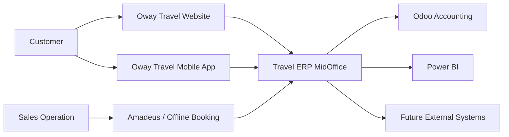
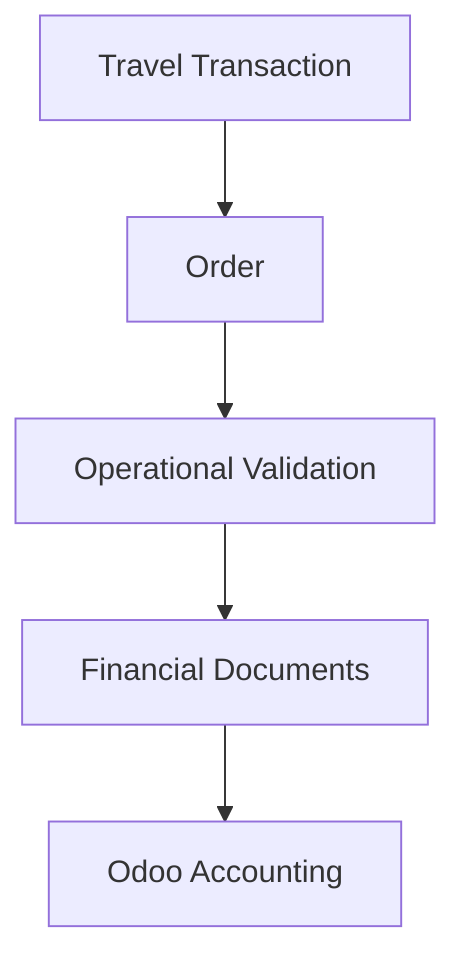
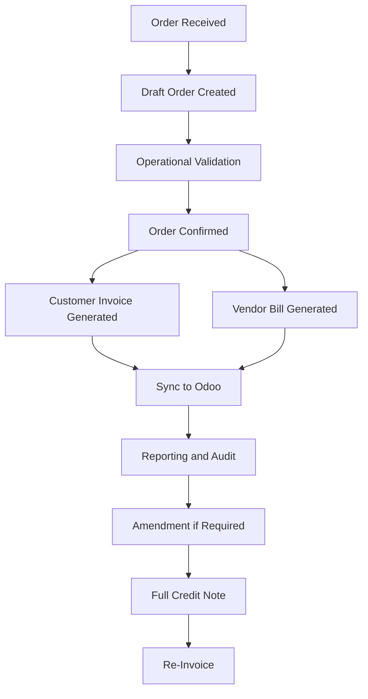

# BUS-000 - Travel ERP Business Overview

**Project:** Travel ERP Enterprise Architecture Handbook  
**Document ID:** BUS-000  
**Document Type:** Business Architecture  
**Version:** 1.0.0  
**Status:** Draft  
**Owner:** ERP Architecture Team  
**Last Updated:** 2026-07-02

---

## Revision History

| Version | Date | Author | Description |
|---|---|---|---|
| 1.0.0 | 2026-07-02 | ERP Architecture Team | Initial business overview created from architecture discovery. |

---

## 1. Purpose

This document defines the business context and operating model of the Travel ERP System.

It explains what the Travel ERP is intended to support, which business capabilities it provides, how operational and accounting responsibilities are separated, and how core business objects such as Orders, Customer Invoices, Vendor Bills, Full Credit Notes, and Re-Invoices fit together.

This document should be read before detailed workflow documents such as Order Management, Customer Invoice, Vendor Bill, Credit Note, Re-Invoice, Payment, Reporting, and Odoo Integration.

---

## 2. Executive Summary

The Travel ERP is the central operational platform for Oway Travel.

It manages the operational lifecycle of travel transactions from order intake through validation, confirmation, accounting document generation, Odoo synchronization, amendment, reporting, and audit.

The Travel ERP is not the accounting system. Odoo is used as the accounting system. The Travel ERP owns operational truth, while Odoo owns accounting truth.

The platform consolidates travel sales from multiple sales channels into a unified MidOffice workflow while preserving financial integrity, operational traceability, and long-term auditability.

---

## 3. Business Mission

The mission of the Travel ERP is:

> To provide a single operational platform that enables Oway Travel to manage every travel transaction consistently, accurately, and auditably across sales channels while integrating with accounting, reporting, and external systems.

---

## 4. Business Scope

The Travel ERP supports operational processing for travel products including:

- Flight
- Hotel
- Bus
- Insurance
- Visa
- Tour Packages
- Future travel products

A single customer purchase may include multiple travel product lines. The Order is treated as one atomic operational business unit even when it includes multiple product lines.

---

## 5. Business Objectives

### Objective 1 - Unified MidOffice Processing

The Travel ERP should provide one consistent operational workflow regardless of whether an Order originates from the website, mobile app, sales operation, Amadeus, or a future partner system.

### Objective 2 - Operational and Accounting Separation

Operations should focus on validation, supplier coordination, customer service, and operational control.

Accounting should focus on ledgers, journals, tax, payments, receivables, payables, and reconciliation.

This separation allows the Travel ERP and Odoo to evolve independently while maintaining a clean integration boundary.

### Objective 3 - Financial Integrity

Once accounting-related documents are generated and synchronized, they must not be modified in place.

Corrections should be handled through controlled business documents such as Full Credit Notes and Re-Invoices.

### Objective 4 - Auditability

The system must preserve enough history to answer business and audit questions such as:

- Which Order generated this Customer Invoice?
- Which Vendor Bills were generated from this Order?
- Which Full Credit Note reversed this Order?
- Which Re-Invoice replaced the original transaction?
- Which user performed the amendment?
- Which exchange rate was used?
- Which tax configuration was applied?

### Objective 5 - Scalable Product Foundation

The platform should support future growth in product types, sales channels, approval policies, reporting requirements, integrations, and business rules without requiring fundamental redesign.

---

## 6. System Landscape

The Travel ERP sits between sales channels, operational teams, accounting, and reporting.

---

## 7. Sales Channels

### 7.1 Online Sales

Online sales originate from the Oway Travel Website or Mobile App.

For online Orders:

- The online platform owns the online commercial price.
- The online platform may apply promotions or discounts.
- The Order is sent to MidOffice after payment is received.
- Product-line exchange rates may be sent through API.

### 7.2 Offline Sales

Offline sales are created by the Sales Operation team, often through external travel systems such as Amadeus, and sent to MidOffice through API or created manually where applicable.

For offline Orders:

- The respective Sales team owns the selling price.
- MidOffice applies order-level currency and finance-approved exchange rate.
- The Order starts in Draft and proceeds through validation and confirmation.

---

## 8. Core Business Actors

| Actor | Responsibility |
|---|---|
| Customer | Purchases travel products |
| Sales Team | Owns offline commercial relationship and selling price |
| Online Platform | Owns online booking, online pricing, promotions, and discounts |
| Operations Team | Validates Orders, supplier data, cost, and operational completeness |
| Finance Team | Owns exchange rate governance, accounting policy, tax policy, and Odoo configuration |
| Odoo | Owns accounting records, journals, receivables, payables, taxes, payments, and reconciliation |
| Power BI | Consumes transaction data for analytics and management reporting |

---

## 9. Core Business Objects

| Object | Description |
|---|---|
| Customer | Required party that purchases travel products |
| Vendor | Supplier providing travel products or services |
| Product | Travel product such as Flight, Hotel, Bus, Insurance, Visa, or Tour Package component |
| Order | Central operational transaction in MidOffice |
| Product Line | Individual travel product or service line within an Order |
| Customer Invoice | Customer billing document generated from one Order |
| Vendor Bill | Supplier payable document generated from product-line cost and vendor grouping |
| Full Credit Note | Full reversal document created by copying original Order and financial documents with negative values |
| Re-Invoice | Replacement workflow that begins with Full Credit Note and creates a new draft Order with revised values |
| Sync Job | Background task used to synchronize data with external systems such as Odoo |

---

## 10. Travel Transaction Concept

The Travel ERP currently implements the Order as the central operational entity.

From a business architecture perspective, the broader business concept is a Travel Transaction.

A Travel Transaction represents the commercial agreement between the customer and the company. The Order is the operational representation of that transaction inside MidOffice.

This distinction allows the business architecture to remain stable even if the technical implementation evolves in the future.

The system does not need to rename the existing Order implementation. The distinction is conceptual and architectural.

---

## 11. Core Business Flow

---

## 12. Order as Atomic Operational Unit

An Order may contain multiple product lines, including tour package components.

However, the Order is validated and confirmed as one operational business unit.

If part of the Order needs to change after invoicing, the system does not edit the original Order directly. Instead, the amendment is handled through Full Credit Note and Re-Invoice workflows.

This design favors auditability, accounting integrity, and operational simplicity over granular partial editing.

---

## 13. Financial Document Strategy

The Travel ERP generates financial business documents before sending accounting data to Odoo.

Key rules:

- One Order generates one Customer Invoice.
- One Order may generate multiple Vendor Bills.
- Vendor Bills are cost-driven.
- Vendor Bills may be grouped by vendor.
- Full Credit Note reverses the original Order and related financial documents using negative values.
- Re-Invoice creates a replacement draft Order after Full Credit Note.

---

## 14. Amendment Philosophy

The Travel ERP uses document-based amendment rather than order-version-based amendment.

This means:

- The original Order remains unchanged and read-only.
- Financial correction is explicit.
- Accounting impact is clear.
- Reporting can reconstruct the full amendment chain.
- Odoo reconciliation is simpler and more traceable.

This is a defining architecture principle of the Travel ERP.

---

## 15. Currency and Tax Responsibility

The Travel ERP supports Base Currency and Transaction Currency.

Current currency design:

- Base Currency: USD
- Transaction Currency: USD or MMK

Exchange rate governance belongs to Finance in MidOffice.

Tax configuration belongs to Finance and Odoo. Odoo remains the accounting tax source of truth, and MidOffice consumes synchronized tax configuration where needed.

---

## 16. Reporting and Analytics

The Travel ERP sends transaction data to Power BI for management reporting.

Reporting should consider:

- Original Orders
- Customer Invoices
- Vendor Bills
- Full Credit Notes
- Re-Invoices
- Full amendment chains
- Final net profitability

Because amendments can occur multiple times, reporting must not focus only on the latest Order. It must preserve chain-level visibility.

---

## 17. Confirmed Architecture

The following points are confirmed from discovery:

- Travel ERP is the operational system of record.
- Odoo is the accounting system.
- Every Order must map to a Customer.
- Online and offline Orders enter MidOffice through different source workflows.
- The MidOffice maintains its own operational lifecycle.
- Operations validates the whole Order.
- One Order generates one Customer Invoice.
- One Order may generate multiple Vendor Bills.
- Vendor Bills are generated only when cost exists.
- Discounts reduce selling price.
- Original Orders are not modified during amendment.
- Full Credit Note copies the original Order and financial documents with negative values.
- Re-Invoice always starts with Full Credit Note.
- Reporting must include the amendment chain.

---

## 18. Current Design and Policy Candidates

The product is still in implementation and has not yet reached beta.

The following areas are current design or policy candidates and may change after user feedback:

- Approval requirements for amendments
- Manager approval thresholds
- Margin policy
- Department-level workflow ownership
- Final Order terminal status naming
- Permission matrix
- Paid or reconciled document amendment controls

These should be designed as configurable business policies wherever practical.

---

## 19. Related Documents

- ARC-000 Design Principles
- REF-001 Order Domain Discovery Record
- GOV-001 Documentation Standard
- GOV-005 Business Rules Catalog
- ADR-001 MidOffice Data Ownership
- ADR-002 Odoo Accounting Responsibility
- ADR-003 Document-Based Amendment Strategy
- BUS-001 Order Management
- BUS-004 Credit Note Workflow
- BUS-005 Re-Invoice Workflow
- ACC-003 Exchange Rate Strategy
- INT-001 Odoo Integration

---

## 20. Open Items

The following items require future discovery or beta feedback:

- Complete organization and permission model
- Final approval flow by department
- Business event catalog
- Business capability map
- Detailed product-line status model
- Customer-facing document numbering for amendment chains
- Future partial credit support
- Reporting KPI definitions
