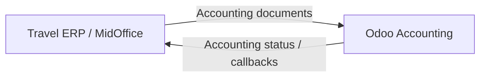

# Travel ERP Enterprise Architecture Handbook

Welcome to the official Travel ERP Enterprise Architecture Handbook.

This handbook defines the architecture, business workflows, accounting design, integration strategy, data model, API conventions, frontend guidance, operations model, standards, requirements, and Architecture Decision Records for the Travel ERP platform.

## Purpose

The handbook exists to provide a durable, reviewable, and maintainable reference for the Travel ERP System.

It is intended for:

- Solution architects
- Software engineers
- Business analysts
- QA engineers
- Finance users
- Odoo integration partners
- DevOps engineers
- Project managers
- Future maintainers

## Core Architecture Position

The Travel ERP is the operational system of record. Odoo is used as the accounting system.

## Handbook Volumes

| Volume | Purpose |
|---|---|
| Governance | Documentation rules, dictionary, index, business rules |
| Architecture | Enterprise architecture and solution design |
| Business | Order, invoice, bill, credit, re-invoice, payment workflows |
| Accounting | Accounting lifecycle, currency, tax, journal, reconciliation |
| Integration | Odoo, callbacks, queues, retries, idempotency |
| Data | Entity model, database standards, audit, settings |
| API | API standards, contracts, authentication, errors |
| Frontend | UI architecture, dashboard, reporting, permissions |
| Operations | Monitoring, logging, deployment, recovery |
| Standards | Reusable technical and business standards |
| ADR | Architecture Decision Records |
| Requirements | Software and business requirements |

## Current Status

The handbook is in initial foundation setup. Governance and architecture foundation documents will be created first, followed by business workflow and integration specifications.
